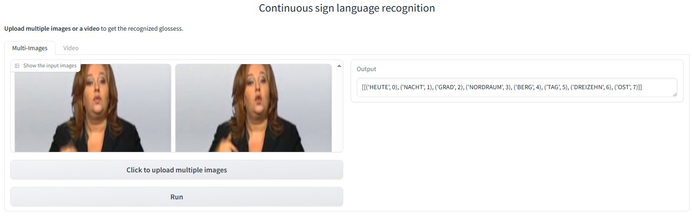

# AdaBrowse
This repo holds codes of the paper: AdaBrowse: Adaptive Video Browser for Efficient Continuous Sign Language Recognition.(ACMMM 2023) [[paper]](https://arxiv.org/abs/2308.08327)

This repo is based on [VAC (ICCV 2021)](https://openaccess.thecvf.com/content/ICCV2021/html/Min_Visual_Alignment_Constraint_for_Continuous_Sign_Language_Recognition_ICCV_2021_paper.html). Many thanks for their great work!

(**Update on 2025/01/28**) We release a demo for Continuous sign language recognition that supports multi-images and video inputs! You can watch the demo video to watch its effects, or deploy a demo locally to test its performance. 

https://github.com/user-attachments/assets/a7354510-e5e0-44af-b283-39707f625a9b

The web demo video

## Prerequisites

- This project is implemented in Pytorch (>1.8). Thus please install Pytorch first.

- ctcdecode==0.4 [[parlance/ctcdecode]](https://github.com/parlance/ctcdecode)，for beam search decode.

- sclite [[kaldi-asr/kaldi]](https://github.com/kaldi-asr/kaldi), install kaldi tool to get sclite for evaluation. 

- [SeanNaren/warp-ctc](https://github.com/SeanNaren/warp-ctc) for ctc supervision.

## Implementation
We now implement our AdaBrowse with three resolution candidates: {96×96, 160×160, 224×224}, and three subsequence lengths: {1/4, 1/2, 1.0}.

## Data Preparation
You can choose any one of following datasets to verify the effectiveness of AdaBrowse.

### PHOENIX2014 dataset
1. Download the RWTH-PHOENIX-Weather 2014 Dataset [[download link]](https://www-i6.informatik.rwth-aachen.de/~koller/RWTH-PHOENIX/). Our experiments based on phoenix-2014.v3.tar.gz.

### PHOENIX2014-T dataset
1. Download the RWTH-PHOENIX-Weather 2014 Dataset [[download link]](https://www-i6.informatik.rwth-aachen.de/~koller/RWTH-PHOENIX-2014-T/)

### CSL dataset

1. Request the CSL Dataset from this website [[download link]](https://ustc-slr.github.io/openresources/cslr-dataset-2015/index.html)

### CSL-Daily dataset

1. Request the CSL-Daily Dataset from this website [[download link]](http://home.ustc.edu.cn/~zhouh156/dataset/csl-daily/)

## Inference

Due to some practical reasons for system deployment, we only provide the weights of stage one and now don't release the weights of stage two for AdaBrowse. One can train the model from stage one to verify the effectiveness of AdaBrowse.

### Training

First, follow the instructions of Stage_one to prepare the weights for resolutions of {96×96, 160×160, 224×224}, or directly use the weights provided by us.

Second, follow the instructions of Stage_two to train AdaBrowse.

### Test with one video input
Except performing inference on datasets, we provide a `test_one_video.py` to perform inference with only one video input. An example command is 

`python test_one_video.py --model_path /path_to_pretrained_weights --video_path /path_to_your_video --device your_device`

The `video_path` can be the path to a video file or a dir contains extracted images from a video. Please conduct this command within the folder of Stage 2.

Acceptable paramters:
- `model_path`, the path to pretrained weights.
- `video_path`, the path to a video file or a dir contains extracted images from a video.
- `device`, which device to run inference, default=0.
- `language`, the target sign language, default='phoenix', choices=['phoenix', 'csl'].
- `max_frames_num`, the max input frames sampled from an input video, default=360.

### Demo
We provide a demo to allow deploying continuous sign language recognition models locally to test its effects. The demo page is shown as follows.

<h4> The page of our demo</h4>

The demo video can be found in the top of this page. An example command is 

`python demo.py --model_path /path_to_pretrained_weights --device your_device`

Please conduct this command within the folder of Stage 2.

Acceptable paramters:
- `model_path`, the path to pretrained weights.
- `device`, which device to run inference, default=0.
- `language`, the target sign language, default='phoenix', choices=['phoenix', 'csl'].
- `max_frames_num`, the max input frames sampled from an input video, default=360.

After running the command, you can visit `http://0.0.0.0:7862` to play with the demo. You can also change it into an public URL by setting `share=True` in line 176 in `demo.py`.
 